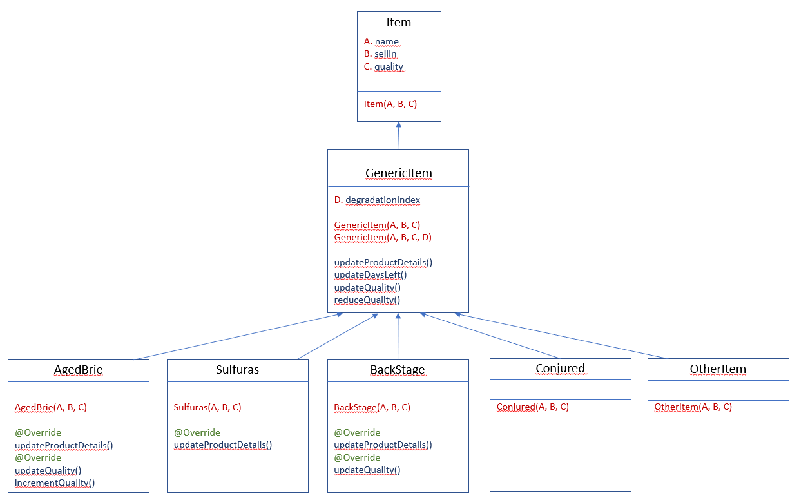

## Wemanity, technical test
#### Mohamed Anis MOALLA

### Class Diagram

***<u>Need analysis</u>***

To be able to analyze the source code, I gived a name for each bloc on the old version of the source code.
Please see the com.gildedrose.oldVersion.GildedRose class.

type \ opertaion | Update quality| Update sellIn
------------- | -------------| -------------
OtherItem | **A)** if(quality > 0) => quality = quality-1   **G)** If(sellIn<0 && quality>0) => quality = quality-1| **D)** sellIn = sellIn-1
Conjured | **A)** if(quality > 0) => quality = quality-2   **G)** If(sellIn<0 && quality>0) => quality = quality-2| **D)** sellIn = sellIn-1
AgedBrie |  **B)** If(quality<50) => quality+1   **E)** if(sellIn < 0 && quality <50) => quality = quality+1| **D)** sellIn = sellIn-1
Sulfuras | fixed: 80| no action (never expired)
Backstage | **B)** if(quality < 50) => quality = quality+1   **C)** If(sellIn<11) => quality = quality+1   **C)** If(sellIn<6) => quality = quality+1   **F)** If(sellIn<0) => quality = 0| **D)** sellIn = sellIn-1

***<u>Base source code problems</u>***
1) As mentioned on the description, Conjured items are not handled properly
2) There is an error on the BackStage logic: 
    As you can see on the table, for those types (OtherItem, Conjured, AgedBrie), the sellIn is updated on the **D)** bloc before using it on tests. 
    On Backstage type:
   *    sellIn is used on the **C)** test bloc
   *    sellIn is changed on the **D)** bloc
   *    sellIn is used on the **F)** test bloc
3) If we had the choice, the class Item should be Abstract. their attributes should be private with getters and setters. 
We can either replace the provided constructor by @AllArgsConstructor lombok annotation.

***<u>Test the solution</u>***

Please run unit tests to test the source code.
For the com.gildedrose.handle.TextTestFixture class, I didn't change the class logic to be able to compare the old version with the new one. 
I created some test for this class to be able to run it as a unit test.

-----------------------------------------------------
***<u>End</u>***
